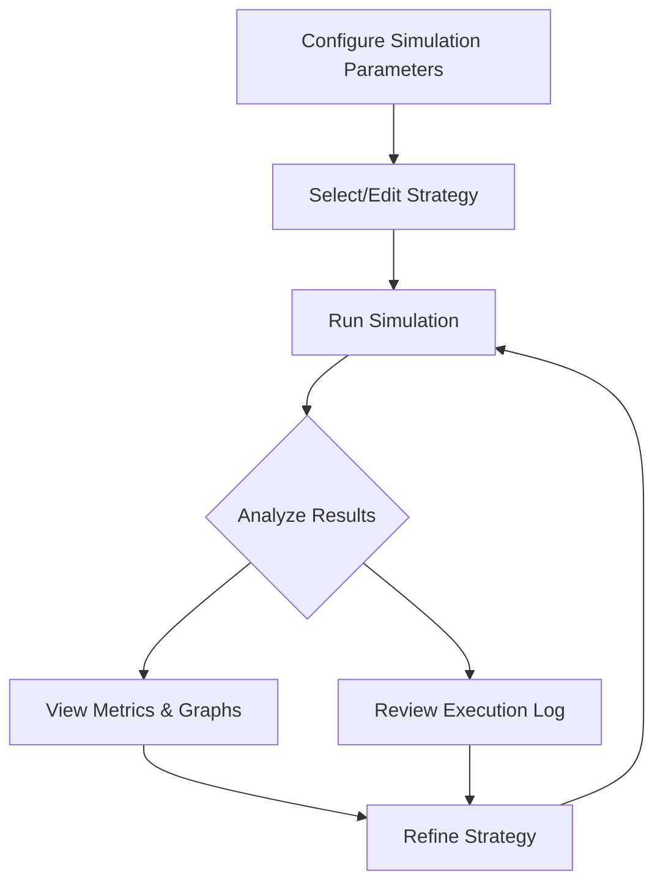

## 1. Product Overview
A professional-grade Roulette Strategy Simulator that allows users to test and refine betting strategies through JavaScript scripting. The simulator provides a realistic casino environment with comprehensive analytics and visualization tools.

- Enables strategy developers and casino enthusiasts to validate roulette betting systems risk-free
- Provides detailed performance metrics and visual analysis to optimize winning strategies
- Targets professional gamblers, strategy developers, and casino game analysts

## 2. Core Features

### 2.1 User Roles
This product is designed for single-user operation without authentication requirements.

### 2.2 Feature Module
The Roulette Strategy Simulator consists of the following integrated interface:
1. **Main Simulator Interface**: Configuration panel, strategy editor, and simulation dashboard in a unified layout

### 2.3 Page Details
| Page Name | Module Name | Feature description |
|-----------|-------------|---------------------|
| Main Simulator Interface | Configuration Panel | Set simulation parameters including starting bankroll, bet limits, number of spins, and table rules (European/American roulette) |
| Main Simulator Interface | Strategy Editor | Write and edit JavaScript betting strategies with syntax highlighting, include 'The One' preset strategy, test strategy logic with immediate feedback |
| Main Simulator Interface | Simulation Dashboard | Display real-time simulation progress, comprehensive metrics (win rate, profit/loss, max drawdown), interactive graphs showing bankroll progression and betting patterns, detailed execution log with spin results and strategy decisions |

## 3. Core Process
Users configure simulation parameters, select or write a betting strategy in JavaScript, then run simulations to analyze performance. The system executes the strategy against random roulette outcomes while tracking all metrics and generating visualizations.

## 4. User Interface Design

### 4.1 Design Style
- **Primary Colors**: Deep black (#0a0a0a) and rich gold (#d4af37)
- **Secondary Colors**: Dark gray (#1a1a1a) and emerald green (#006400)
- **Button Style**: Sleek 3D buttons with gradient effects and hover animations
- **Font**: Modern sans-serif (Inter or similar) with sizes 14px for body, 18-24px for headers
- **Layout**: Card-based dark theme with subtle borders and glass-morphism effects
- **Icons**: Casino-themed emoji and premium SVG icons with gold accents

### 4.2 Page Design Overview
| Page Name | Module Name | UI Elements |
|-----------|-------------|-------------|
| Main Simulator Interface | Configuration Panel | Dark card layout with gold-accented input fields, numeric steppers for values, dropdown selectors for roulette variants, prominent 'Start Simulation' button |
| Main Simulator Interface | Strategy Editor | Monaco-editor style code editor with syntax highlighting, collapsible preset strategy panel, real-time error checking with inline feedback |
| Main Simulator Interface | Simulation Dashboard | Full-width metrics cards with animated counters, responsive Recharts graphs with dark theme, scrollable execution log with color-coded entries, progress indicator with spin counter |

### 4.3 Responsiveness
Desktop-first design with mobile responsiveness. The interface adapts to tablet and mobile screens with collapsible panels and touch-optimized controls. Graphs and metrics rearrange for optimal viewing on smaller screens.

