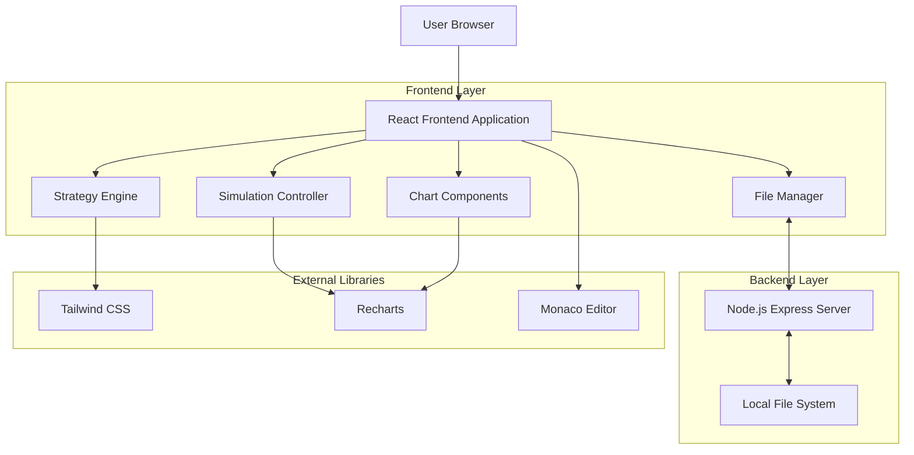
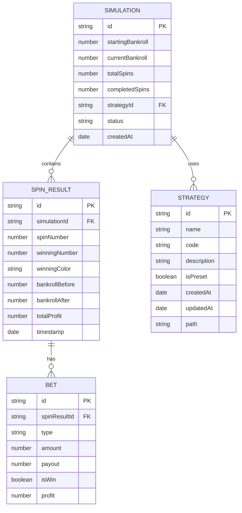

## 1. Architecture design



## 2. Technology Description
- **Frontend**: React@18 + TailwindCSS@3 + Vite
- **Backend**: Node.js + Express
- **Charting**: Recharts@2
- **Code Editor**: Monaco Editor (VS Code editor)
- **State Management**: React Context API + useReducer + Zustand
- **Build Tool**: Vite@6

## 3. Route definitions
| Route | Purpose |
|-------|---------|
| / | Main simulator interface with all components |

## 4. API definitions
The application uses a local Node.js server to manage strategy files.

| Method | Endpoint | Description |
|--------|----------|-------------|
| GET | /api/files | Retrieve the full file tree of strategies |
| POST | /api/save | Save strategy content to a file |
| POST | /api/delete | Delete a file or directory |
| POST | /api/rename | Rename or move a file/directory |
| POST | /api/create-dir | Create a new directory |
| POST | /api/duplicate | Duplicate an existing file or directory |

## 5. Server architecture diagram
The server is a lightweight Node.js Express application that serves as a bridge between the frontend and the local file system.


## 6. Data model

### 6.1 Data model definition


### 6.2 Data Definition Language
Data is stored in two ways:
1. **Strategies**: Stored as physical `.js` files in the `strategies/` directory.
2. **Simulation State**: Stored in browser memory and localStorage.

```javascript
// Strategy File Node Structure (Backend)
interface FileNode {
  id: string; // Relative path
  parentId: string;
  name: string;
  type: 'file' | 'directory';
  content?: string; // Only for files
  children?: string[]; // IDs of children
  metadata: {
    createdAt: number;
    updatedAt: number;
    size: number;
  };
}

// Simulation State Structure (Frontend)
interface SimulationState {
  id: string;
  config: {
    startingBankroll: number;
    maxSpins: number;
    tableType: 'european' | 'american';
    betLimits: {
      min: number;
      max: number;
    };
  };
  strategy: {
    id: string;
    name: string;
    code: string;
  };
  results: {
    spins: SpinResult[];
    metrics: {
      totalProfit: number;
      winRate: number;
      maxDrawdown: number;
      averageBet: number;
      finalBankroll: number;
    };
  };
  status: 'idle' | 'running' | 'paused' | 'completed';
}
```
