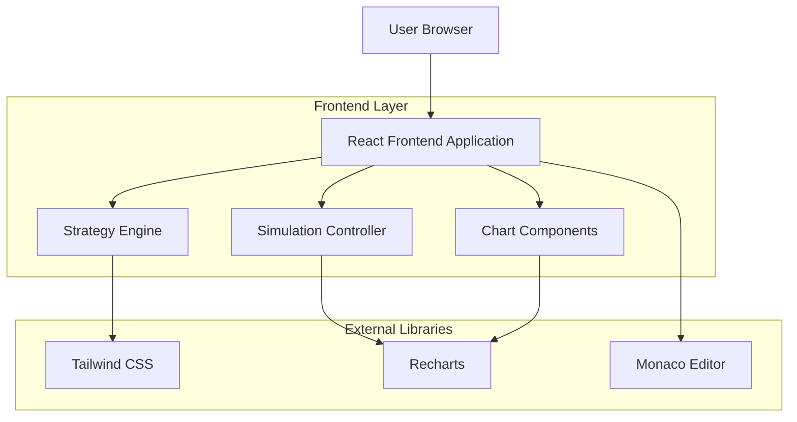
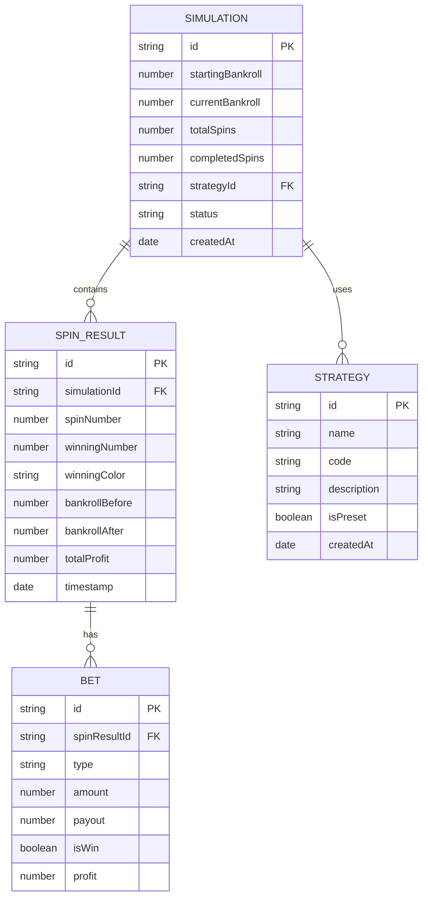

## 1. Architecture design



## 2. Technology Description
- Frontend: React@18 + TailwindCSS@3 + Vite
- Charting: Recharts@2
- Code Editor: Monaco Editor (VS Code editor)
- State Management: React Context API + useReducer
- Build Tool: Vite@4

## 3. Route definitions
| Route | Purpose |
|-------|---------|
| / | Main simulator interface with all components |
| /strategy/:id | Shareable strategy link (optional feature) |

## 4. API definitions
This is a client-side only application with no backend API requirements.

## 5. Server architecture diagram
No server architecture required - this is a pure frontend application.

## 6. Data model

### 6.1 Data model definition


### 6.2 Data Definition Language
Since this is a client-side application, data is stored in browser localStorage and JavaScript objects:

```javascript
// Simulation State Structure
interface SimulationState {
  id: string;
  config: {
    startingBankroll: number;
    maxSpins: number;
    tableType: 'european' | 'american';
    betLimits: {
      min: number;
      max: number;
    };
  };
  strategy: {
    id: string;
    name: string;
    code: string;
  };
  results: {
    spins: SpinResult[];
    metrics: {
      totalProfit: number;
      winRate: number;
      maxDrawdown: number;
      averageBet: number;
      finalBankroll: number;
    };
  };
  status: 'idle' | 'running' | 'paused' | 'completed';
}

// Strategy Preset Data
const strategyPresets = [
  {
    id: 'the-one',
    name: 'The One',
    description: 'A proven roulette strategy with progressive betting',
    code: `function bet(spinHistory, bankroll) {
  // Progressive betting strategy
  if (spinHistory.length === 0) return { bet: 1, type: 'red' };
  
  const lastSpin = spinHistory[spinHistory.length - 1];
  if (lastSpin.color === 'red') {
    return { bet: 1, type: 'black' };
  } else {
    return { bet: Math.min(bankroll * 0.05, 100), type: 'red' };
  }
}`
  }
];
```
